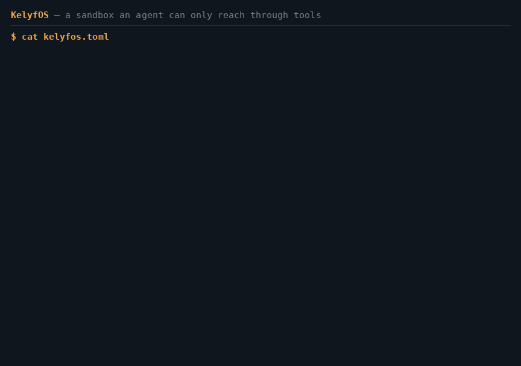

# KelyfOS

**A sandbox an AI agent can only reach through tools.**

KelyfOS is a minimal guest operating system for Firecracker microVMs. The guest
has no shell login, no SSH and no network by default — it exposes itself to an
agent as a handful of MCP tools, keeps your credentials outside the box
entirely, and writes down everything that happened in a record the guest cannot
edit.



> **Status: v1.0, building in the open.** Cold boot-to-ready **134 ms**
> median, snapshot restore **48 ms**; five agents up in **343–543 ms**. Every
> figure is measured by a workflow in this repository, and
> [where they came from](#the-numbers-and-where-they-came-from) says which
> workflow, how many runs, and why the third one is a range rather than a number.
>
> **What v1.0 promises:** [`docs/compatibility.md`](docs/compatibility.md) names
> the surfaces that will not move under you — and, the half that matters more,
> the ones that deliberately may. The release is built by CI from the tag's own
> commit. An exported session report verifies offline, on a machine with no
> sandbox and no guest.
>
> **An agent is still root inside its own guest, and the VM — not the chroot — is
> the boundary.** [**What is enforced, and what is not**](#security) is a table
> and a longer list; [`docs/threat-model.md`](docs/threat-model.md) is the long
> version, and it is the thing to read before trusting this with anything.

KelyfOS — from κέλυφος (*kélyfos*), "shell": the guest wrapped around the agent.

## Why

The agent-sandbox runtimes all build control planes and boot a generic
Ubuntu inside. Nobody ships the *guest* as an opinionated product. That is the
gap: an image whose init system speaks MCP, whose egress is deny-all, whose
secrets never enter the VM, and whose audit trail is tamper-evident by
construction.

Three things it does that a container does not:

- **Egress is off, not filtered.** No `--allow` means the machine has no network
  interface at all. There is no rule that has to hold for the guarantee to be true.
- **Secrets never enter the guest.** `--secret GITHUB_TOKEN@api.github.com` keeps
  the value on the host; the proxy attaches it on the way out. `env` in the
  sandbox shows nothing.
- **The record is written by the host.** A guest that could write its own audit
  trail could write a flattering one, so it cannot write one at all. And the
  export carries that record inside it, so whoever you send it to checks it
  themselves — `kelyfos verify report.html`, offline, no key.

## Quickstart

Firecracker needs Linux and KVM. On a Linux box with `/dev/kvm`, nothing else is
needed. On Windows, WSL2 — and it is post-1.0, with the compatibility document
saying so by name.

**On macOS there is a Linux layer, and kelyfos looks after it.** There is a macOS
build of the CLI, and you never type `limactl start`:

```sh
brew install lima
kelyfos doctor --setup     # provision the layer and start it
kelyfos doctor             # its state, whether it matches this binary, and the
                           # in-VM doctor's own output
kelyfos doctor --stop
```

**The layer needs Apple M3 or newer and macOS 15+**, because it needs nested
virtualisation from Virtualization.framework; without it `/dev/kvm` never appears
inside the Lima guest and the instance fails its own probe at start. `doctor`
says this too, at the point where it stops.

**Getting the macOS binary is a build for now.** `dev/install-kelyfos.sh`
downloads `kelyfos-linux-<arch>` and is Linux-only; `make release-cli`
cross-builds the darwin pair into `dist/`, and unlike `make cli` it is not gated
on Linux. The release workflow stages those binaries alongside the Linux ones, so
from the first release it builds they are a download instead.

**The macOS binaries are unsigned, and Gatekeeper will say so.** There is no
Apple Developer identity for this project, so a `kelyfos` downloaded through a
browser is quarantined and refused with *"cannot be opened because the developer
cannot be verified"* — which reads like a corrupt download and is not one. It is
the absence of a signature, nothing else. Clear the quarantine attribute if you
want to run it:

```sh
xattr -d com.apple.quarantine ./kelyfos     # only after you have checked SHA256SUMS
```

Check the checksum first, because that sentence is asking you to override the
one thing macOS does on your behalf. Signing and notarization are post-1.0 and
wait on an identity rather than on engineering (D55).

It is a smaller program than the Linux one and it says so. `doctor` owns the
layer, `verify` checks a report somebody sent you — that one matters, because the
machine a report is sent to is often a Mac and checking it needs no guest — and
everything that needs a guest refuses with the way in rather than letting you
discover a missing `/dev/kvm`. **What it does not do is "the same commands
everywhere":** that needs a transport across `limactl shell`, and an interrupt
does not cross it, so a Ctrl-C would orphan a microVM and silently discard the
workspace it was syncing back.

```sh
git clone https://github.com/p4r4n0rm4l/KelyfOS && cd KelyfOS
```

On macOS, clone it somewhere under your home directory — that is what the Lima
VM mounts, and `limactl shell` keeps your working directory, so the commands
below just work.

Measured end to end — `git clone` to the first `kelyfos exec` output —
**against `v1.0-rc2`**, the artifacts this release actually ships, because a
number measured against the release before it is a number about something else.

**KelyfOS's own part is about 2 seconds, and the download is the rest.** Split
that way because they scale with different things. Installing the CLI from the
release and verifying its checksum was 46 ms, unpacking the guest image 552 ms,
`kelyfos doctor` 9 ms, and the first `kelyfos run` through to `exec` output
1.0 s — of which 861 ms was the machine booting. Nothing there depends on your
connection.

**The download does.** The whole release is 117 MB across both architectures and
took 102 s here; a quickstart needs roughly half of that, being one architecture.
That number is your network and GitHub's, not ours, and it is quoted separately
rather than folded into a total that would flatter us on a fast link and look
broken on a slow one.

On macOS you also pay for the Linux layer, and that part is Lima's rather than
ours: **28 s** when it already has the Ubuntu image, **138 s** when it has to
download it. Both are measured, on the same machine, minutes apart. We are not
going to quote you the flattering one and call it the number.

**On macOS first — a Linux layer with nested virtualisation** (skip on Linux).
This step downloads and boots an Ubuntu VM, and is most of that wall clock:

```sh
brew install lima
kelyfos doctor --setup             # not `limactl start`: an instance made by hand
                                   # carries no marker, and doctor can then only
                                   # tell you it does not know what it was made from
limactl shell kelyfos-dev          # everything below runs in here
```

**Then, on Linux or inside that shell.** Nothing here needs a compiler — the CLI
is a static binary and the guest image is prebuilt:

```sh
bash dev/install-firecracker.sh    # the VMM and its jailer
bash dev/install-kelyfos.sh        # the CLI
bash dev/fetch-image.sh            # the guest image

# KelyfOS runs Firecracker inside the jailer — a chroot, a dropped uid, only
# the devices it needs — and the jailer needs root. This grants it for the
# jailer alone, and for nothing else:
echo "$USER ALL=(root) NOPASSWD: $(command -v jailer)" \
  | sudo tee /etc/sudoers.d/kelyfos-jailer
sudo chmod 0440 /etc/sudoers.d/kelyfos-jailer

./bin/kelyfos doctor               # checks all four, the jailer included
```

`kelyfos run --no-jail` works without that grant. It says what is not enforced
on every run that uses it, and the session record says so too — see
[`docs/hardening.md`](docs/hardening.md).

Each of those verifies what it downloaded against a published checksum before
installing it, and shows you doing so — a mismatch aborts with nothing written:

```
Fetching KelyfOS latest image for x86_64 from p4r4n0rm4l/KelyfOS
  SHA256SUMS
  vmlinux-x86_64.gz
  rootfs-x86_64.ext4.gz
  image-x86_64.json
Verifying checksums
vmlinux-x86_64.gz: OK
rootfs-x86_64.ext4.gz: OK
image-x86_64.json: OK
Decompressing

Installed the 'dev' image for x86_64 into ~/.cache/kelyfos/out/x86_64
Run it with:  kelyfos run --image dev
```

**Now run something in it:**

```sh
./bin/kelyfos run --image dev --allow github.com &
./bin/kelyfos exec "uname -a"
./bin/kelyfos exec "git clone --depth 1 https://github.com/kelseyhightower/nocode /work/nc"
./bin/kelyfos exec "curl -sS https://example.com"    # refused: not in the allowlist
./bin/kelyfos log --verify
```

`kelyfos doctor` is the thing to run first on any new machine: it checks nine
things and prints the exact fix for whatever is wrong, tailored to whether you
are on Lima, WSL2, bare Linux or macOS.

### Building it yourself

Releases are built from this source at the release tag by
[`.github/workflows/release.yml`](.github/workflows/release.yml) — both
architectures in one workflow run, from the tag's own commit, with `SHA256SUMS`
regenerated from scratch over exactly the files attached. **`v1.0-rc2` is the
first release it built**, and it earned itself on the first attempt: rc1's build
failed at the SBOM attestation, because `actions/attest` decides a document is
CycloneDX by looking for a `serialNumber` and Buildroot's generator emits none —
so every SBOM this project had ever produced would have been refused. The step
had never run before, because no release had ever been built by a workflow.

Releases up to and including v0.9 were assembled by hand from a laptop, and it
showed: v0.9's two architectures were built on two different machines, one of
them a developer's.

**Whether they are bit-for-bit what your own `make image` produces is measured,
not claimed.** Determinism is configured — `BR2_REPRODUCIBLE`,
`SOURCE_DATE_EPOCH` from the commit, a fixed filesystem UUID and hash seed,
`gzip -n` — and configuring it is not the same as it working, so
[`repro-check`](.github/workflows/repro-check.yml) builds the same commit twice
and diffs the result, per artifact.

What it has reported so far, and what it covers but has not reported on yet —
the scope is part of the result:

| artifact | result | how |
| --- | --- | --- |
| `kelyfos-linux-{aarch64,x86_64}` | **identical** | built twice from two *different* source paths |
| `kelyfos-darwin-{aarch64,x86_64}` | **not measured yet** | inside the check, built and compared the same way; no run has reported on them |
| `Image`, `rootfs.ext4`, `image.json` (aarch64/dev) | **identical** | two full builds from nothing, same machine, same build path |

The image half is a stronger result than expected and a narrower one than
"reproducible builds": one machine, one architecture, an identical build path —
which is what Buildroot's own reproducible mode requires — and two builds rather
than many. x86_64 has not been measured. The macOS row is exactly what it says:
`repro-check` compares every binary `make release-cli` produces, so those two
are no longer outside the only check this project makes about them — but being
inside a check is not a measurement, and this table reports runs rather than
coverage. The workflow is what keeps the answer current, and whatever it last
said is what this page says. Building it yourself takes about thirty-five
minutes, because it compiles a cross toolchain, a kernel and a userland:

```sh
bash dev/install-build-deps.sh     # compiler, Buildroot prerequisites, pinned Go
make cli
make image FLAVOR=dev              # or ARCH=x86_64, FLAVOR=base
```

Either way the image carries an `image.json` manifest recording its arch,
flavor, the SHA-256 of both artifacts and the pinned Buildroot and Linux
versions. The sandbox reads it and refuses to boot if it does not match what you
asked for, so `--image dev` can never quietly run something else — the flavor in
your audit trail is a checked fact, not a label you typed.

**A release the workflow builds carries a provenance attestation**: a statement,
signed by GitHub, saying which workflow and which commit produced these exact
bytes. `v1.0-rc2` has one, and every release from here does. **It is still a
draft rather than a published release**, so a stranger cannot download it yet —
publishing is a person's decision, deliberately, and the workflow drafts so that
the last step before anybody downloads anything is somebody looking at it. One
command checks the attestation, and it needs nothing from this project:

```sh
gh attestation verify kelyfos-linux-x86_64 --repo p4r4n0rm4l/KelyfOS
```

That is SLSA v1.0 Build Level 2 — a hosted builder attesting to its own output —
and it verifies offline against a trusted root fetched once. Each architecture's
SBOM is attested the same way, against that architecture's artifacts.

**It is not the same claim as GitHub's immutable releases**, and the two must not
be read as one. Immutability says GitHub received these bytes under this tag and
nobody has replaced them since; it carries **no builder identity at all**.
Provenance says which workflow built them. A release can have either without the
other.

## Attaching an agent

The sandbox is a toolbox, not a computer. The shortest path is to let `kelyfos`
own the agent's lifetime:

```sh
kelyfos run --workspace . --allow github.com -- claude
```

That boots a sandbox, runs your agent with `KELYFOS_SANDBOX` set so its tools
attach to that machine, and tears everything down when the agent exits —
`kelyfos` exits with the agent's own status, so it composes in a script.

There are two doors, and which one a client wants depends on who owns the
sandbox's lifetime. `kelyfos serve-mcp` is the outward one: the client has no
sandbox yet, and the tools are for getting one. `kelyfos mcp` is the inward
bridge to a sandbox that already exists.

A client wants `serve-mcp`, and it must be told where the policy is —
`--policy <path>`, absolutely, because the working directory a client launches
from is the client's and not yours, and a server that finds no policy runs with
no ceiling at all:

```json
{
  "mcpServers": {
    "kelyfos": {
      "type": "stdio",
      "command": "/abs/path/to/kelyfos",
      "args": ["serve-mcp", "--policy", "/abs/path/to/kelyfos.toml"]
    }
  }
}
```

This repository's own [`.mcp.json`](.mcp.json) runs
[`dev/mcp-server.sh`](dev/mcp-server.sh) instead of naming a binary directly,
because the macOS form has to cross into the Lima layer — `limactl shell
kelyfos-dev -- <abs path> serve-mcp --policy <abs path>` — and a VM name and an
absolute path do not belong in a file a Linux contributor also checks out. The
script picks the right form for the machine it runs on and says what is wrong
when it cannot.

Writing that file by hand is what `kelyfos connect <client>` is for: it writes
each client's own file, in that client's own format and location, and `--check`
then starts the server it just configured and completes a real MCP handshake.
[`docs/integrating.md`](docs/integrating.md) has the per-client shapes.

A client attached to `serve-mcp` that way sees twelve host-side tools — the
`sandbox_*` family that boots, runs, stops, snapshots and forks machines, plus
`team_up`, `team_ps` and `team_down`. [`docs/reference/tools.md`](docs/reference/tools.md)
is generated from the servers themselves and lists every one.

**Inside** a sandbox the surface is smaller and different: an agent reached
through `kelyfos mcp` or `kelyfos run … -- <agent>` sees six tools — `exec`,
`read_file`, `write_file`, `list_dir`, `upload`, `download` — and nothing else.
In a team it sees the team tools too, and a `[[plugin]]` adds its own namespaced
ones — and nothing else still.

## Policy travels with the project

Commit a `kelyfos.toml` the way you commit a `.devcontainer`, and bare
`kelyfos run` picks it up:

```toml
[sandbox]
image     = "dev"
allow     = ["github.com", "pypi.org"]
secrets   = ["GITHUB_TOKEN@api.github.com"]   # names only — never values
workspace = "."

[resources]                 # hard ceilings: a flag may ask for less, never more
cpus        = 2             # cores the guest sees
cpu_quota   = "150%"        # ...but at most 1.5 cores' worth of host CPU time
mem         = "2G"
disk        = "4G"          # ceiling on the packed /work image, refused before boot
scratch     = "512M"        # everything written outside /work
net_mbps_rx = 50
disk_mbps   = 100
max_runtime = "30m"
idle_timeout = "5m"         # no tool call and no traffic for that long ends it
```

`[resources]` are limits, not defaults — `--cpus 8` against `cpus = 2` refuses
at boot and names the line it came from, rather than quietly clamping.

Every one of them but `scratch` is enforced on the **host**: KVM machine config,
a cgroup v2 `cpu.max`, Firecracker's own token-bucket rate limiters, device sizes
and a host timer. The guest runs untrusted code and is never asked to police
itself — `scratch` is the one exception and is named as one: it is a `size=` the
guest's own kernel applies to its tmpfs, bounded underneath by the `mem` the VM
was built with, which is enforced on the host. Much the same is true of the
receipt: a `kelyfos run` session, and every agent in a team, ends with a
`resource.summary` event recording what it consumed beside what it was allowed,
measured from counters the kernel keeps about the VMM process. Sandboxes created
through `serve-mcp`, `fork`, `snapshot restore` and the E2B shim do not carry one
yet, and neither does a session that ends in a pause: the receipt is taken at
teardown, a pause is not one, and `resume` does not add it afterwards. `kelyfos
watch` shows the same figures live. See [`docs/resources.md`](docs/resources.md),
and `bash dev/prove-caps.sh` to watch each cap refuse to budge.

## Agent teams

Several sandboxes on one host, with the paths between them written down. A
`[team]` section declares the agents and the edges; `kelyfos team up` boots the
graph. Docker-compose for agent teams — master/workers, a pipeline, a mesh, or
islands: the edge list *is* the topology.

```toml
[team]
name = "suppliers"
  [team.resources]
  cpu_quota = "200%"        # two cores' worth, for all of them together

[[team.agent]]
name = "master"
allow = ["example.com"]     # the only agent that may reach the network

[[team.agent]]
name  = "worker"
count = 4                   # four workers, no egress at all

[[team.edge]]
from = "master"
to   = "worker-*"           # a star: no worker may reach another worker
```

**No guest ever has a network path to another guest.** Every inter-agent message
travels the host broker over the existing vsock channels, is checked against the
edge list, and lands in the audit record — including the ones it refused. The
guest sees seven more MCP tools: `team_send`, `team_recv`, `team_ask`,
`team_reply`, `team_peers`, `team_store_get`, `team_store_put` — plus a
`team_spawn` shown only to an agent whose policy granted a spawn budget.

A team is **one session**, so `kelyfos log --verify` over it verifies the whole
team and says which agents it covered, `kelyfos verify team.html` lets whoever
you send the export to do the same, and `kelyfos log --export team.html`
draws one lane per agent with the message flow between them. `kelyfos watch`
shows the same shape live.

The first `team up` of a given shape boots every agent cold and builds a fork
template in the background; a later one forks the agents that have no egress and no
workspace of their own, where two or more share a shape, from that template in
tens of milliseconds. An agent with egress is always cold-booted — a
fork cannot carry a network identity. `kelyfos team ps` says which path each
machine took.

[`docs/teams.md`](docs/teams.md) is the full account.

## What else it does

| | |
| --- | --- |
| `kelyfos snapshot save\|restore` | freeze a prepared machine, bring it back in ~48 ms |
| `kelyfos fork -n 4` | four divergent copies of one snapshot, sharing its memory image |
| `kelyfos run --workspace ./dir` | your files at `/work`, written back on clean shutdown |
| `kelyfos log --export report.html` | a self-contained session report, carrying the record it was rendered from |
| `kelyfos verify report.html` | re-runs the chain over that record: offline, no key, no network |
| `kelyfos connect <client>` | writes that client's own MCP configuration, and `--check` starts the server it names |
| `kelyfos watch` | a live view, one lane per agent when it is a team |
| `kelyfos team up\|ps\|down` | boot a declared team, see it, stop it |
| `kelyfos serve-mcp` | [KelyfOS as an MCP server](docs/mcp-surface.md): any client gets sandboxes, files, snapshots, forks and teams as tools |
| `[[plugin]]` in `kelyfos.toml` | an MCP server of your own, running inside the guest, its tools namespaced into the agent's session |
| `kelyfos shim` | an [E2B-compatible subset](docs/e2b-shim.md) for existing SDK code |
| `kelyfos bench` | reproducible boot and restore timings |
| `kelyfos run --max-runtime 30m` | a wall-clock budget; expiry is SIGTERM, grace, sync-back, exit 124 |

And the parts that make it a thing you reach for rather than tolerate (v0.8):

| | |
| --- | --- |
| `kelyfos pause --as <name>` / `resume` | stop for the day and pick up the *same machine* — its memory, its scratch, its half-finished thing — under the policy it was frozen with |
| `kelyfos diff` / `run --review` | what the agent changed, and a yes before any of it reaches your directory |
| `kelyfos shell` | a real terminal inside the sandbox: job control, line editing, resize. The record always says one was opened and how it ended; what was typed and shown needs `--transcript` |
| `kelyfos run -p 8080:80` | reach a server inside the sandbox. Over vsock, so the firewall is untouched and it works with no network at all |
| `kelyfos runs` / `rerun <id>` | what has run here, and run one again under its own frozen policy |
| every refusal | names the fix: `add allow = ["api.stripe.com"] to kelyfos.toml, or rerun with --allow api.stripe.com` |
| `--notify` | a desktop notification when a run finishes, is blocked, times out, or is waiting for your answer |

## Documentation

| | |
| --- | --- |
| [`docs/README.md`](docs/README.md) | the entry map: what each document is, and where it is thin |
| [`llms.txt`](llms.txt) · [`llms-full.txt`](llms-full.txt) | for machine readers: an index per the llmstxt.org spec, and the whole set in one file, whose current size `llms.txt` states |
| [`docs/reference/`](docs/reference/) | every command, flag, toml key, MCP tool, event and exit code — generated from the source |
| [`PLAN.html`](PLAN.html) · [`PLAN-FEATURES.html`](PLAN-FEATURES.html) | the living plan — every decision and the full progress log, phases then epics |
| [`docs/cookbook.md`](docs/cookbook.md) | eighteen recipes that work: run one, allowlist a domain, fork, build a team, point a client at it, write a plugin, verify the log, pause and resume, review a diff, forward a port, draw a team's topology, export it as OTLP |
| [`docs/integrating.md`](docs/integrating.md) | building on it: the four ways in, orchestrator patterns, common mistakes |
| [`docs/mcp-surface.md`](docs/mcp-surface.md) | MCP in both directions: `serve-mcp` as a tool for any client, `[[plugin]]` servers inside the guest |
| [`docs/threat-model.md`](docs/threat-model.md) | what is defended, and what is not |
| [`docs/protocol.md`](docs/protocol.md) | the host/guest wire protocol |
| [`docs/compatibility.md`](docs/compatibility.md) | what v1.0 promises will not move, and what is allowed to |
| [`CHANGELOG.md`](CHANGELOG.md) · [`docs/upgrading.md`](docs/upgrading.md) | what changed in each release, and what to do about the things that broke |
| [`docs/events.md`](docs/events.md) | the audit event schema |
| [`docs/networking.md`](docs/networking.md) | egress design and the nftables rules |
| [`docs/resources.md`](docs/resources.md) | resource limits: units, precedence, what enforces what |
| [`docs/teams.md`](docs/teams.md) | agent teams: the schema, the broker, the store, the budget |
| [`docs/e2b-shim.md`](docs/e2b-shim.md) | the E2B compatibility subset |

## The numbers, and where they came from

Every figure above is measured on the bare-KVM reference — a stock
`ubuntu-latest` GitHub runner with KVM — and by a workflow in this repository
rather than by hand. Two workflows, not one, because they measure different
things: boot and restore are `kelyfos bench` under
[`bench.yml`](.github/workflows/bench.yml), ten runs each; the five-agent figures
are `dev/demo-team.sh` under [`caps.yml`](.github/workflows/caps.yml), **one run
each**. Local numbers on a Mac are 6–8× slower because of nested virtualisation
and are never the published ones.

**Ten runs and one run are different kinds of number, so they are printed
differently.** Boot and restore are medians over ten samples and are steady:
`130, 130, 134, 135, 140, 134, 141, 133, 132, 143` for boot. The five-agent
figure is a single sample, and re-measuring it twice on the same commit gave
343 ms and 543 ms cold — a spread of 58% — against 285 ms and 384 ms forked.
That is a property of one cold sample on a machine shared with the rest of
GitHub, not of KelyfOS, and it is the reason a range is printed where a single
number would read as more precise than the measurement is.

Boot was 123 ms and restore 37 ms at v0.8. The jailer and the guest-profile probe
sit on the boot path and cost about 12 ms each way; the VMM's filter check is
read after boot-to-ready has been taken and is not in the number. Both were
re-measured across that change rather than assumed through it. The
targets — ≤ 300 ms cold, ≤ 100 ms restore — still hold with room, and **v1.0
re-measured them across everything this phase put on the boot path**: 134 ms and
48 ms, against 135 ms and 49 ms at v0.9. The workspace extraction was rewritten
in this phase and cost nothing that ten runs can see.

The five-agent figures are the graph in `dev/demo-team.toml`, with the master
booting cold either way because a fork cannot carry a network identity. They
replace 366 ms and 215 ms from before the guest kernel moved to the 6.12 LTS
line, measured the same way on the same graph.

## Security

Every release before v0.9 said **"not hardened yet"**, and it was true: KelyfOS
relied on the boundary Firecracker gives it and added nothing of its own around
the VMM process or around what a compromised agent could reach inside its guest.
Both layers exist now. Here is what that does and does not mean.

One of them was incomplete until this phase, and the sentence above was true of
the guest and not of the host. An external audit found that the **workspace block
device** — which the guest writes and the host reads back — let a guest-authored
directory entry decide where the host wrote, and the trust-boundary table did not
list that surface at all. It is closed and listed now; the row below is what
closed it. **It closed on `main` after v0.9 was tagged**, so the release the
quickstart downloads still extracts a workspace the old way.

**What is enforced.**

| | |
| --- | --- |
| the boundary | a Firecracker microVM: a separate kernel, a hardware boundary. This was always the case and is still the thing that matters most. |
| around the VMM | the jailer: a chroot holding only this sandbox's files, a dropped uid, `no_new_privs`, only the device nodes it needs, and the run's cgroup when the policy set a quota. Every entry point, or none — `run`, `team up`, `fork`, `snapshot restore`, `serve-mcp` and the shim all go through one refusal. |
| the VMM's syscalls | Firecracker's own seccomp filter, **read out of `/proc` on every one of its threads** at boot rather than assumed from the absence of a flag. A VMM without it is refused, not run. [`docs/host-seccomp.md`](docs/host-seccomp.md) lists every syscall it permits, read back out of the running kernel. |
| inside the guest | every process the supervisor spawns — `exec`, a plugin, the shell — is confined by Landlock (writes only `/work`, `/tmp`, `/run`, `$HOME`, `/dev/pts` and `/dev/shm`, plus seven named device nodes) and a seccomp refusal list of 28 syscalls. Per flavor; [`docs/reference/profiles.md`](docs/reference/profiles.md) is generated from the code that enforces it. **The supervisor is PID 1 and the profile does not confine it**, which is where `write_file` and `upload` could once write anywhere the guest asked, including the block devices the profile withholds; those two are now held to the same three lists the profile is built from. Reads are deliberately not restricted. |
| the network | no interface at all without `--allow`; then deny-all plus a hostname allowlist, with credentials attached by the host's proxy so the value never exists inside the guest. |
| the workspace disk | the guest writes that filesystem, so the host reads it back the way it reads anything hostile: every entry validated and the image refused whole if one is a name the host cannot use, and the extraction written through `openat2` with `RESOLVE_BENEATH` and `RESOLVE_NO_SYMLINKS` so a name that got past the check still cannot leave the tree. Setuid, setgid, sticky and world-write do not survive onto your filesystem; the rest of the mode does, including the executable bit, because an agent that built a binary needs it. |
| the record | hash-chained, written by the host, and it names which walls were around each machine — so a transcript cannot make an unconfined run look like a confined one. |

**What is not.** None of this is a claim to be a multi-tenant sandbox for
hostile code; it is a single-host developer tool (D1).

- **An agent is still root inside its own guest**, and always was. The profile
  narrows what root can ask the kernel for; it does not make the kernel smaller.
- **The chroot is not the boundary.** The VM is. The jailer makes an escape from
  Firecracker far less useful; anyone who tells you a chroot is a security
  boundary is selling something.
- **The VMM drops to you, not to a dedicated account** (D29), so a uid it shares
  with your shell is a uid that could signal or `ptrace` your other processes.
  A service account closes that and costs a setup step.
- **Side channels** — timing, cache, speculative execution — are untouched.
  KelyfOS inherits Firecracker's position and adds nothing.
- **The supply chain is partly answered now, and the parts are different sizes.**
  The release workflow attaches a build-provenance attestation and an SBOM to
  every artifact, and from `v1.0-rc2` it has actually done so; reproducibility is
  measured per artifact rather than claimed. What is *not*
  answered is the layer beneath: the Buildroot packages, the compiler and the
  upstream tarballs are taken on trust, verified by checksum against what
  upstream published and no further. A hardened runtime built from an unverified
  toolchain is still a locked door in a wall nobody measured; the door is now
  documented down to its hinges, and the wall is not.
- **Anything your policy permits.** A sandbox allowed to reach `api.github.com`
  with a token bound to it can do whatever that token can do.

[`docs/threat-model.md`](docs/threat-model.md) is the long version, including the
trade-off TLS termination represents. [`docs/hardening.md`](docs/hardening.md) is
the specification these layers were built against, and its §5 is a longer list of
what remains reachable.

Report vulnerabilities privately — [`SECURITY.md`](SECURITY.md) has the channel,
and says which findings are in scope and which are documented design decisions.

## Building on it

The guest toolchain — Buildroot, the kernel, Firecracker and Go — is pinned in
[`versions.mk`](versions.mk), and Go modules in `go.mod`. The host build packages
are not pinned. Reproducibility is no longer open but measured, per artifact and
with its scope stated — the table under "Building it yourself" is what it says.
Contributions need a DCO `Signed-off-by` line. The non-goals in `PLAN.html`
section 2 are hard boundaries — no orchestrator, no control plane, no hosted
service.

## License

Apache-2.0.
